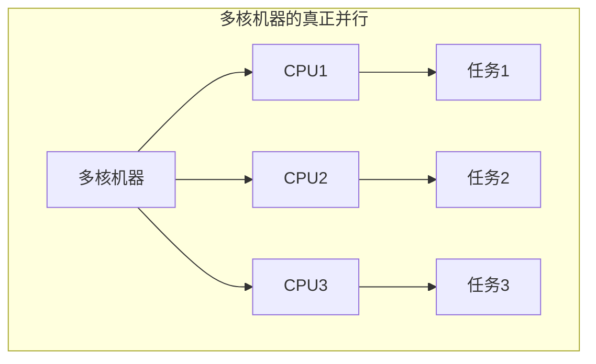
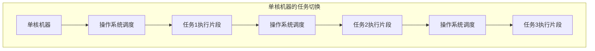

# 基本概念

## 前言

&emsp;&emsp;在我们谈起“*并发编程*”，其实可以直接简单理解为“**多线程编程**”，我知道你或许有疑问：“那多进程呢？” C++ 语言层面没有进程的概念，并发支持库也不涉及多进程，所以在本教程中，不用在意。

&emsp;&emsp;我们主要使用标准 C++ 进行教学，也会稍微涉及一些其它库。

## 并发

并发，指两个或两个以上的独立活动同时发生。

并发在生活中随处可见，我们可以一边走路一边说话，也可以两只手同时做不同的动作，又或者一边看电视一边吃零食。

## 在计算机中的并发

计算机中的并发有两种方式：

1. 多核机器的真正**并行**。

2. 单核机器的**任务切换**。

&emsp;&emsp;在早期，一些单核机器，它要想并发，执行多个任务，那就只能是任务切换，任务切换会给你一种“**好像**这些任务都在同时执行”的假象。只有硬件上是多核的，才能进行真正的并行，也就是真正的”**同时执行任务**“。

&emsp;&emsp;在现在，我们日常使用的机器，基本上是二者都有。我们现在的 CPU 基本都是多核，而操作系统调度基本也一样有任务切换，因为要执行的任务非常之多，CPU 是很快的，但是核心却没有那么多，不可能每一个任务都单独给一个核心。大家可以打开自己电脑的任务管理器看一眼，进程至少上百个，线程更是上千。这基本不可能每一个任务分配一个核心，都并行，而且也没必要。正是任务切换使得这些后台任务可以运行，这样系统使用者就可以同时运行文字处理器、编译器、编辑器和 Web 浏览器。

## 并发与并行

事实上，对于这两个术语，并没有非常公认的说法。

1. 有些人认为二者毫无关系，指代的东西完全不同。

2. 有些人认为二者大多数时候是相同的，只是用于描述一些东西的时候关注点不同。

我喜欢第二种，那我们就讲第二种。

对多线程来说，这两个概念大部分是重叠的。对于很多人来说，它们没有什么区别。
这两个词是用来描述硬件同时执行多个任务的方式：

- “并行”更加注重性能。使用硬件提高数据处理速度时，会讨论程序的并行性。

- 当关注重点在于任务分离或任务响应时，会讨论程序的并发性。

这两个术语存在的目的，就是为了区别多线程中不同的关注点。

## 总结

&emsp;&emsp;概念从来不是我们的重点，尤其是某些说法准确性也一般，假设开发者对操作系统等知识有基本了解。

&emsp;&emsp;我们也不打算**特别介绍**什么 C++ 并发库的历史发展、什么时候你该使用多线程、什么时候不该使用多线程... 类似问题应该是看你自己的，而我们回到代码上即可。
