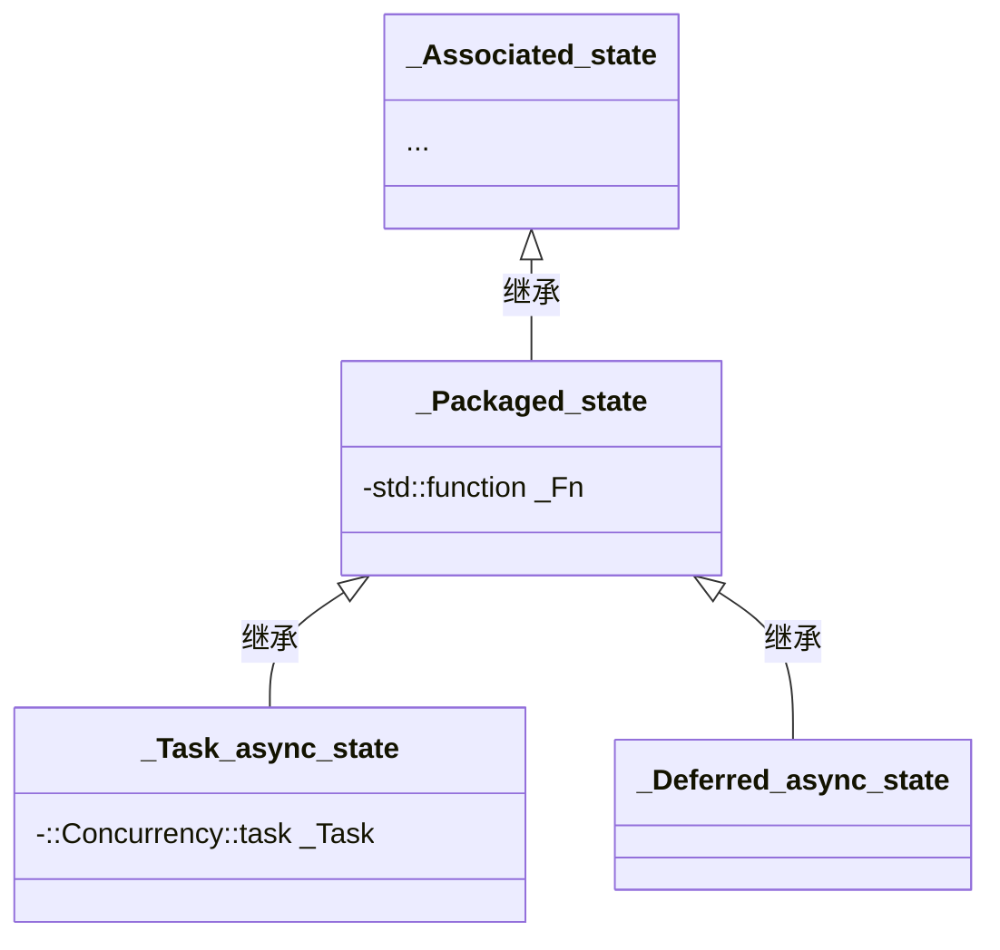

# `st::async` 与 `std::future` 源码解析

## 前言

和之前一样的，我们以 MSVC STL 的实现进行讲解。

`std::future`，即未来体，是用来管理一个共享状态的类模板，用于等待关联任务的完成并获取其返回值。它自身不包含状态，需要通过如 `std::async` 之类的函数进行初始化。`std::async` 函数模板返回一个已经初始化且具有共享状态的 `std::future` 对象。

因此，所有操作的开始应从 `std::async` 开始讲述。

需要注意的是，它们的实现彼此之间会共用不少设施，在讲述 `std::async` 源码的时候，对于 `std::future` 的内容同样重要。

> MSVC STL 很早之前就不支持 C++11 了，它的实现完全基于 **C++14**，出于某些原因 **C++17** 的一些库（如 [`invoke`](https://zh.cppreference.com/w/cpp/utility/functional/invoke)， _v 变量模板）被向后移植到了 **C++14** 模式，所以即使是 C++11 标准库设施，实现中可能也是使用到了 C++14、17 的东西。
>
> 注意，不用感到奇怪。

## `std::async`

```cpp
_EXPORT_STD template <class _Fty, class... _ArgTypes>
_NODISCARD_ASYNC future<_Invoke_result_t<decay_t<_Fty>, decay_t<_ArgTypes>...>> async(
    launch _Policy, _Fty&& _Fnarg, _ArgTypes&&... _Args) {
    // manages a callable object launched with supplied policy
    using _Ret   = _Invoke_result_t<decay_t<_Fty>, decay_t<_ArgTypes>...>;
    using _Ptype = typename _P_arg_type<_Ret>::type;
    _Promise<_Ptype> _Pr(
        _Get_associated_state<_Ret>(_Policy, _Fake_no_copy_callable_adapter<_Fty, _ArgTypes...>(
                                                 _STD forward<_Fty>(_Fnarg), _STD forward<_ArgTypes>(_Args)...)));

    return future<_Ret>(_From_raw_state_tag{}, _Pr._Get_state_for_future());
}

_EXPORT_STD template <class _Fty, class... _ArgTypes>
_NODISCARD_ASYNC future<_Invoke_result_t<decay_t<_Fty>, decay_t<_ArgTypes>...>> async(
    _Fty&& _Fnarg, _ArgTypes&&... _Args) {
    // manages a callable object launched with default policy
    return _STD async(launch::async | launch::deferred, _STD forward<_Fty>(_Fnarg), _STD forward<_ArgTypes>(_Args)...);
}
```

这段代码最直观的信息是，函数模板 `std::async` 有两个重载，其中第二个重载只是给了一个执行策略并将参数全部转发，调用第一个重载。也就是不指明执行策略的时候就会匹配到第二个重载版本。因此我们也只需要关注第二个版本了。

1. **模板参数和函数体外部信息**：

   - `_EXPOPT_STD` 是一个宏，当 `_BUILD_STD_MODULE` 宏定义且启用了 C++20 时，会被定义为 `export`，以便导出模块；否则它为空。

   - `_Fty` 表示可调用对象的类型。
   - `_ArgTypes` 是一个类型形参包，表示调用该可调用对象所需的参数类型。
   - `_NODISCARD_ASYNC` 是一个宏，表示属性 `[[nodiscard]]`，用于标记此函数的返回值不应被忽略。

2. 函数返回类型：

   ```cpp
   future<_Invoke_result_t<decay_t<_Fty>, decay_t<_ArgTypes>...>>
   ```

   虽然看起来复杂，但实际上是通过 `_Invoke_result_t` 获取可调用对象的返回类型。与标准库中的 [`std::invoke_result_t`](https://zh.cppreference.com/w/cpp/types/result_of) 基本相同。

   可以举一个使用 `std::invoke_result_t` 的例子：

   ```cpp
   template<class Fty, class... ArgTypes>
   std::future<std::invoke_result_t<std::decay_t<Fty>,std::decay_t<ArgTypes>...>>
   test_fun(Fty&& f,ArgTypes&&... args){
       return std::async(std::launch::async, std::forward<Fty>(f), std::forward<ArgTypes>(args)...);
   }
   
   auto result = test_fun([](int) {return 1; }, 1); // std::future<int>
   ```

   值得注意的是，所有类型在传递前都进行了 [`decay`](https://zh.cppreference.com/w/cpp/types/decay) 处理，也就是说不存在引用类型，是默认按值传递与 `std::thread` 的行为一致。

3. 函数形参：

   ```cpp
   async(launch _Policy, _Fty&& _Fnarg, _ArgTypes&&... _Args)
   ```

   `launch _Policy`: 表示任务的执行策略，可以是 `launch::async`（表示异步执行）或 `launch::deferred`（表示延迟执行），或者两者的组合。

   `_Fty&& _Fnarg`: 可调用对象，通过完美转发机制将其转发给实际的异步任务。

   `_ArgTypes&&... _Args`: 调用该可调用对象时所需的参数，同样通过完美转发机制进行转发。

4. `using _Ret   = _Invoke_result_t<decay_t<_Fty>, decay_t<_ArgTypes>...>;`

   `using _Ptype = typename _P_arg_type<_Ret>::type;`

   - 定义 `_Ret` 类型别名，它是使用 `_ArgTypes` 类型参数调用 `_Fty` 类型的可调用对象后得到的结果类型。也就是我们传入的可调用对象的返回类型；同样使用了 `_Invoke_result_t`（等价于  [`std::invoke_result_t`](https://zh.cppreference.com/w/cpp/types/result_of) ） 与 `decay_t`。

   - 其实 `_Ptype` 的定义确实在大多数情况下和 `_Ret` 是相同的，类模板 _P_arg_type 只是为了处理引用类型以及 void 的情况，参见 `_P_arg_type` 的实现：

     ```cpp
     template <class _Fret>
     struct _P_arg_type { // type for functions returning T
         using type = _Fret;
     };
     
     template <class _Fret>
     struct _P_arg_type<_Fret&> { // type for functions returning reference to T
         using type = _Fret*;
     };
     
     template <>
     struct _P_arg_type<void> { // type for functions returning void
         using type = int;
     };
     ```

     `_Ptype`：处理异步任务返回值的方式类型，它在语义上强调了异步任务返回值的处理方式，具有不同的实现逻辑和使用场景。在当前我们难以直接展示它的作用，不过可以推测，这个“`P`” 表示的是后文将使用的 `_Promise` 类模板。也就是说，定义 `_Ptype` 是为了配合 `_Promise` 的使用。我们将会在后文详细探讨 `_Promise` 类型的内部实现，并进一步解释 `_Ptype` 的具体作用。

5. `_Promise<_Ptype> _Pr`

   [`_Promise`](https://github.com/microsoft/STL/blob/f54203f/stl/inc/future#L999-L1055) 类型本身不重要，很简单，关键还在于其存储的数据成员。

   ```cpp
   template <class _Ty>
   class _Promise {
   public:
       _Promise(_Associated_state<_Ty>* _State_ptr) noexcept : _State(_State_ptr, false), _Future_retrieved(false) {}
   
       _Promise(_Promise&&) = default;
   
       _Promise& operator=(_Promise&&) = default;
   
       void _Swap(_Promise& _Other) noexcept {
           _State._Swap(_Other._State);
           _STD swap(_Future_retrieved, _Other._Future_retrieved);
       }
   
       const _State_manager<_Ty>& _Get_state() const noexcept {
           return _State;
       }
       _State_manager<_Ty>& _Get_state() noexcept {
           return _State;
       }
   
       _State_manager<_Ty>& _Get_state_for_set() {
           if (!_State.valid()) {
               _Throw_future_error2(future_errc::no_state);
           }
   
           return _State;
       }
   
       _State_manager<_Ty>& _Get_state_for_future() {
           if (!_State.valid()) {
               _Throw_future_error2(future_errc::no_state);
           }
   
           if (_Future_retrieved) {
               _Throw_future_error2(future_errc::future_already_retrieved);
           }
   
           _Future_retrieved = true;
           return _State;
       }
   
       bool _Is_valid() const noexcept {
           return _State.valid();
       }
   
       bool _Is_ready() const noexcept {
           return _State._Is_ready();
       }
   
       _Promise(const _Promise&)            = delete;
       _Promise& operator=(const _Promise&) = delete;
   
   private:
       _State_manager<_Ty> _State;
       bool _Future_retrieved;
   };
   ```

   `_Promise` 类模板是对 **[`_State_manager`](https://github.com/microsoft/STL/blob/f54203f/stl/inc/future#L688-L825) 类模板的包装**，并增加了一个表示状态的成员 `_Future_retrieved`。

   状态成员用于跟踪 `_Promise` 是否已经调用过 `_Get_state_for_future()` 成员函数；它默认为 `false`，在**第一次**调用 `_Get_state_for_future()` 成员函数时被置为 `true`，如果二次调用，就会抛出 [`future_errc::future_already_retrieved`](https://zh.cppreference.com/w/cpp/thread/future_errc) 异常。

   > 这类似于 `std::promise` 调用 [`get_future()`](https://zh.cppreference.com/w/cpp/thread/promise/get_future) 成员函数。[测试](https://godbolt.org/z/8anc9b3PT)。

   `_Promise` 的构造函数接受的却不是 `_State_manager` 类型的对象，而是 `_Associated_state` 类型的指针，用来初始化数据成员 `_State`。

   ```cpp
   _State(_State_ptr, false)
   ```

   这是因为实际上 `_State_manager` 类型的[实现](https://github.com/microsoft/STL/blob/f54203f/stl/inc/future#L822-L824)就是保有了 [`Associated_state`](https://github.com/microsoft/STL/blob/f54203f/stl/inc/future#L198-L445) 指针，以及一个状态成员：

   ```cpp
   private:
       _Associated_state<_Ty>* _Assoc_state = nullptr;
       bool _Get_only_once                  = false;
   ```

   也可以简单理解 `_State_manager` 又是对 `Associated_state` 的包装，其中的大部分接口实际上是调用 `_Assoc_state` 的成员函数，如：

   ```cpp
   void wait() const { // wait for signal
       if (!valid()) {
           _Throw_future_error2(future_errc::no_state);
       }
   
       _Assoc_state->_Wait();
   }
   ```

   - **一切的重点，最终在 `Associated_state` 上**。

   然而它也是最为复杂的，我们在讲 `std::thread`-构造源码解析 中提到过一句话：

   > - **了解一个庞大的类，最简单的方式就是先看它的数据成员有什么**。

   ```cpp
   public:
       conditional_t<is_default_constructible_v<_Ty>, _Ty, _Result_holder<_Ty>> _Result;
       exception_ptr _Exception;
       mutex _Mtx;
       condition_variable _Cond;
       bool _Retrieved;
       int _Ready;
       bool _Ready_at_thread_exit; // TRANSITION, ABI
       bool _Has_stored_result;
       bool _Running;
   ```

    这是 `Associated_state` 的数据成员，其中有许多的 `bool` 类型的状态成员，同时最为明显重要的三个设施是：**异常指针**、**互斥量**、**条件变量**。

   根据这些数据成员我们就能很轻松的猜测出 `Associated_state` 模板类的作用和工作方式。

   - **异常指针**：用于存储异步任务中可能发生的异常，以便在调用 `future::get` 时能够重新抛出异常。
   - **互斥量和条件变量**：用于在异步任务和等待任务之间进行同步。当异步任务完成时，条件变量会通知等待的任务。

   **`_Associated_state` 模板类负责管理异步任务的状态，包括结果的存储、异常的处理以及任务完成的通知。它是实现 `std::future` 和 `std::promise` 的核心组件之一**，通过 `_State_manager` 和 `_Promise` 类模板对其进行封装和管理，提供更高级别的接口和功能。

   ```plaintext
   +---------------------+
   |    _Promise<_Ty>    |
   |---------------------|
   | - _State            | -----> +---------------------+
   | - _Future_retrieved |       |  _State_manager<_Ty> |
   +---------------------+       |----------------------|
                                 | - _Assoc_state       | -----> +-------------------------+
                                 | - _Get_only_once     |       | _Associated_state<_Ty>*   |
                                 +----------------------+       +-------------------------+
   ```

   上图是 `_Promise`、_`State_manager`、`_Associated_state` 之间的**包含关系示意图**，理解这个关系对我们后面**非常重要**。

   到此就可以了，我们不需要在此处就详细介绍这三个类，但是你需要大概的看一下，这非常重要。

6. 初始化 `_Promie` 对象：

   `_Get_associated_state<_Ret>(_Policy, _Fake_no_copy_callable_adapter<_Fty, _ArgTypes...>(_STD forward<_Fty>(_Fnarg), _STD forward<_ArgTypes>(_Args)...))`

   很明显，这是一个函数调用，将我们 `std::async` 的参数全部转发给它，它是重要而直观的。

   [`_Get_associated_state`](https://github.com/microsoft/STL/blob/f54203f/stl/inc/future#L1400-L1410) 函数根据启动模式（`launch`）来决定创建的异步任务状态对象类型：

   ```cpp
   template <class _Ret, class _Fty>
   _Associated_state<typename _P_arg_type<_Ret>::type>* _Get_associated_state(launch _Psync, _Fty&& _Fnarg) {
       // construct associated asynchronous state object for the launch type
       switch (_Psync) { // select launch type
       case launch::deferred:
           return new _Deferred_async_state<_Ret>(_STD forward<_Fty>(_Fnarg));
       case launch::async: // TRANSITION, fixed in vMajorNext, should create a new thread here
       default:
           return new _Task_async_state<_Ret>(_STD forward<_Fty>(_Fnarg));
       }
   }
   ```

   `_Get_associated_state` 函数返回一个 `_Associated_state` 指针，该指针指向一个新的 `_Deferred_async_state` 或 `_Task_async_state` 对象。这两个类分别对应于异步任务的两种不同执行策略：**延迟执行**和**异步执行**。

   > 其实就是父类指针指向了子类对象，注意 **`_Associated_state` 是有虚函数的**，子类进行覆盖，这很重要。比如在后续聊 `std::future` 的 `get()` 成员函数的时候就会讲到

   > 这段代码也很好的说明在 MSVC STL 中，`launch::async | launch::deferred` 和 `launch::async` 的行为是相同的，即都是异步执行。

   ---

   **[`_Task_async_state`](https://github.com/microsoft/STL/blob/f54203f/stl/inc/future#L654-L686) 与 `_Deferred_async_state` 类型**

   ```cpp
   template <class _Rx>
   class _Task_async_state : public _Packaged_state<_Rx()>
   template <class _Rx>
   class _Deferred_async_state : public _Packaged_state<_Rx()>
   ```

   `_Task_async_state` 与 `_Deferred_async_state` 都继承自 [`_Packaged_state`](https://github.com/microsoft/STL/blob/f54203f/stl/inc/future#L462-L597)，用于异步执行任务。它们的构造函数都接受一个函数对象，并将其转发给基类 `_Packaged_state` 的构造函数。

   **`_Packaged_state` 类型只有一个数据成员 `std::function` 类型的对象 `_Fn`，它用来存储需要执行的异步任务**，而它又继承自 `_Associated_state`。

   ```cpp
   template <class _Ret, class... _ArgTypes>
   class _Packaged_state<_Ret(_ArgTypes...)>
       : public _Associated_state<_Ret>
   ```

   ```mermaid
   classDiagram
      class _Associated_state {
          ...
      }
   
      class _Packaged_state {
          -std::function _Fn
      }
   
      class _Task_async_state {
          -::Concurrency::task<void> _Task
      }
   
      class _Deferred_async_state {
      }
   
      _Associated_state <|-- _Packaged_state : 继承
      _Packaged_state <|-- _Task_async_state : 继承
      _Packaged_state <|-- _Deferred_async_state : 继承
   
   ```

   我们直接先看 `_Task_async_state` 与 `_Deferred_async_state` 类型的构造函数实现即可：

   ```cpp
   template <class _Fty2>
   _Task_async_state(_Fty2&& _Fnarg) : _Mybase(_STD forward<_Fty2>(_Fnarg)) {
       _Task = ::Concurrency::create_task([this]() { // do it now
           this->_Call_immediate();
       });
   
       this->_Running = true;
   }
   template <class _Fty2>
   _Deferred_async_state(const _Fty2& _Fnarg) : _Packaged_state<_Rx()>(_Fnarg) {}
   
   template <class _Fty2>
   _Deferred_async_state(_Fty2&& _Fnarg) : _Packaged_state<_Rx()>(_STD forward<_Fty2>(_Fnarg)) {}
   ```

   `_Task_async_state` 它的数据成员：

   ```cpp
   private:
       ::Concurrency::task<void> _Task;
   ```

   `_Task_async_state` 的实现使用到了微软自己实现的 [并行模式库](https://learn.microsoft.com/zh-cn/cpp/parallel/concrt/parallel-patterns-library-ppl?view=msvc-170)（PPL），简而言之 `launch::async` 策略并不是单纯的创建线程让任务执行，而是使用了微软的 `::Concurrency::create_task` ，它从**线程池**中获取线程并执行任务返回包装对象。

   `this->_Call_immediate();` 是调用 `_Task_async_state` 的父类 `_Packaged_state` 的成员函数 `_Call_immediate` 。

   **`_Packaged_state` 有三个偏特化**，`_Call_immediate` 自然也拥有三个不同版本，用来应对我们传入的函数对象**返回类型**的三种情况：

     - 返回普通类型 [`_Packaged_state<_Ret(_ArgTypes...)>`](https://github.com/microsoft/STL/blob/f54203f/stl/inc/future#L554)

     ```cpp
     void _Call_immediate(_ArgTypes... _Args) {
         _TRY_BEGIN
         // 调用函数对象并捕获异常 传递返回值
         this->_Set_value(_Fn(_STD forward<_ArgTypes>(_Args)...), false);
         _CATCH_ALL
         // 函数对象抛出异常就记录
         this->_Set_exception(_STD current_exception(), false);
         _CATCH_END
     }
     ```

     - 返回引用类型 [`_Packaged_state<_Ret&(_ArgTypes...)>`](https://github.com/microsoft/STL/blob/f54203f/stl/inc/future#L510)

     ```cpp
     void _Call_immediate(_ArgTypes... _Args) {
         _TRY_BEGIN
         // 调用函数对象并捕获异常 传递返回值的地址
         this->_Set_value(_STD addressof(_Fn(_STD forward<_ArgTypes>(_Args)...)), false);
         _CATCH_ALL
         // 函数对象抛出异常就记录
         this->_Set_exception(_STD current_exception(), false);
         _CATCH_END
     }
     ```

   - 返回 void 类型 [`_Packaged_state<void(_ArgTypes...)>`](https://github.com/microsoft/STL/blob/f54203f/stl/inc/future#L554)

   ```cpp
   void _Call_immediate(_ArgTypes... _Args) { // call function object
       _TRY_BEGIN
       // 调用函数对象并捕获异常 因为返回 void 不获取返回值 而是直接 _Set_value 传递一个 1
       _Fn(_STD forward<_ArgTypes>(_Args)...);
       this->_Set_value(1, false);
       _CATCH_ALL
       // 函数对象抛出异常就记录
       this->_Set_exception(_STD current_exception(), false);
       _CATCH_END
   }
   ```

    说白了，无非是把返回引用类型的可调用对象返回的引用获取地址传递给 `_Set_value`，把返回 void 类型的可调用对象传递一个 1 表示正确执行的状态给 `_Set_value`。

   `_Call_immediate` 则又调用了父类 `_Associated_state` 的成员函数（`_Set_value`、`_set_exception`），传递的可调用对象执行结果，以及可能的异常，将结果或异常存储在 `_Associated_state` 中。

   `_Deferred_async_state` 并不会在线程中执行任务，但它同样调用 `_Call_immediate` 函数执行保有的函数对象，它有一个 `_Run_deferred_function` 函数：

   ```cpp
   void _Run_deferred_function(unique_lock<mutex>& _Lock) override { // run the deferred function
       _Lock.unlock();
       _Packaged_state<_Rx()>::_Call_immediate();
       _Lock.lock();
   }
   ```

   然后也就和上面说的没什么区别了 。

7. 返回 `std::future`

   `return future<_Ret>(_From_raw_state_tag{}, _Pr._Get_state_for_future());`

   它选择到了 `std::future` 的构造函数是：

   ```cpp
   future(_From_raw_state_tag, const _Mybase& _State) noexcept : _Mybase(_State, true) {}
   ```

   > ```cpp
   > using _Mybase = _State_manager<_Ty*>;
   > ```

   `_From_raw_state_tag` 是一个空类，并没有什么特殊作用，只是为了区分重载。

   `_Get_state_for_future` 代码如下：

   ```cpp
   _State_manager<_Ty>& _Get_state_for_future() {
       if (!_State.valid()) {
           _Throw_future_error2(future_errc::no_state);
       }
   
       if (_Future_retrieved) {
           _Throw_future_error2(future_errc::future_already_retrieved);
       }
   
       _Future_retrieved = true;
       return _State;
   }
   ```

   检查状态，修改状态，返回底层 `_State` ，完成转移状态。

   总而言之这行代码通过调用 `std::future` 的特定构造函数，将 `_Promise` 对象中的 `_State_manager` 状态转移到 `std::future` 对象中，从而创建并返回一个 `std::future` 对象。这使得 `std::future` 可以访问并管理异步任务的状态，包括获取任务的结果或异常，并等待任务的完成。

## `std::future`

先前的 `std::async` 的内容非常之多，希望各位开发者不要搞晕了，其实重中之重主要是那几个类，关系图如下：

```plaintext
+---------------------+
|    _Promise<_Ty>    |
|---------------------|
| - _State            | -----> +---------------------+
| - _Future_retrieved |       |  _State_manager<_Ty> |
+---------------------+       |----------------------|
                              | - _Assoc_state       | -----> +-------------------------+
                              | - _Get_only_once     |       | _Associated_state<_Ty>*   |
                              +----------------------+       +-------------------------+
```

> `_Promise`、_`State_manager`、`_Associated_state` 之间的**包含关系示意图**。



> `_Asscociated_state`、`_Packaged_state`、`_Task_async_state`、`_Deferred_async_state` **继承关系示意图**。

这其中的 `_Associated_state`、`_State_manager` 类型是我们的核心，它在后续 `std::future` 乃至其它并发设施都有众多使用。

---

介绍 `std::future` 的源码我认为无需过多篇幅或者示例，引入过多的源码实现等等从头讲解，只会让各位开发者感觉复杂难。

我们直接从它的最重要、常见的 `get()`、`wait()` 成员函数开始即可。

```cpp
std::future<int> future = std::async([] { return 0; });
future.get();
```

我们先前已经详细介绍过了 `std::async` 返回 `std::future` 的步骤。以上这段代码，唯一的问题是：*`future.get()` 做了什么？*

```cpp
_EXPORT_STD template <class _Ty>
class future : public _State_manager<_Ty> {
    // class that defines a non-copyable asynchronous return object that holds a value
private:
    using _Mybase = _State_manager<_Ty>;

public:
    static_assert(!is_array_v<_Ty> && is_object_v<_Ty> && is_destructible_v<_Ty>,
        "T in future<T> must meet the Cpp17Destructible requirements (N4950 [futures.unique.future]/4).");

    future() = default;

    future(future&& _Other) noexcept : _Mybase(_STD move(_Other), true) {}

    future& operator=(future&&) = default;

    future(_From_raw_state_tag, const _Mybase& _State) noexcept : _Mybase(_State, true) {}

    _Ty get() {
        // block until ready then return the stored result or throw the stored exception
        future _Local{_STD move(*this)};
        return _STD move(_Local._Get_value());
    }

    _NODISCARD shared_future<_Ty> share() noexcept {
        return shared_future<_Ty>(_STD move(*this));
    }

    future(const future&)            = delete;
    future& operator=(const future&) = delete;
};
```

> `std::future` 其实还有两种特化，不过整体大差不差。
>
> ```cpp
> template <class _Ty>
> class future<_Ty&> : public _State_manager<_Ty*>
> ```
>
> ```cpp
> template <>
> class future<void> : public _State_manager<int>
> ```
>
> 也就是对返回类型为引用和 void 的情况了。其实先前已经聊过很多次了，无非就是内部的返回引用实际按指针操作，返回 void，那么也得给个 1。参见前面的 `_Call_immediate` 实现。

可以看到 `std::future` 整体代码实现很少，很简单，那是因为其实现细节都在其父类 `_State_manager` 。然而 `_State_manager` 又保有一个 `_Associated_state<_Ty>*` 类型的成员。而 **`_Associated_state` 又是一切的核心**，之前已经详细描述过了。

阅读 `std::future` 的源码你可能注意到了一个问题：*没有 `wait()`*成员函数？*

它的定义来自于父类 `_State_manager` ：

```cpp
void wait() const { // wait for signal
    if (!valid()) {
        _Throw_future_error2(future_errc::no_state);
    }

    _Assoc_state->_Wait();
}
```

然而这还不够，实际上还需要调用了 `_Associated_state` 的 `wait()` 成员函数：

```cpp
virtual void _Wait() { // wait for signal
    unique_lock<mutex> _Lock(_Mtx);
    _Maybe_run_deferred_function(_Lock);
    while (!_Ready) {
        _Cond.wait(_Lock);
    }
}
```

先使用锁进行保护，然后调用函数，再循环等待任务执行完毕。`_Maybe_run_deferred_function`：

```cpp
void _Maybe_run_deferred_function(unique_lock<mutex>& _Lock) { // run a deferred function if not already done
    if (!_Running) { // run the function
        _Running = true;
        _Run_deferred_function(_Lock);
    }
}
```

`_Run_deferred_function` 相信你不会陌生，在讲述 `std::async` 源码中其实已经提到了，就是解锁然后调用 `_Call_immediate` 罢了。

```cpp
void _Run_deferred_function(unique_lock<mutex>& _Lock) override { // run the deferred function
    _Lock.unlock();
    _Packaged_state<_Rx()>::_Call_immediate();
    _Lock.lock();
}
```

> `_Call_immediate` 就是执行我们实际传入的函数对象，先前已经提过。

在 `_Wait` 函数中调用 `_Maybe_run_deferred_function` 是为了确保延迟执行（`launch::deferred`）的任务能够在等待前被启动并执行完毕。这样，在调用 `wait` 时可以正确地等待任务完成。

至于下面的循环等待部分：

```cpp
while (!_Ready) {
    _Cond.wait(_Lock);
}
```

这段代码使用了条件变量、互斥量、以及一个状态对象，主要目的有两个：

1. **避免虚假唤醒**：
   - 条件变量的 `wait` 函数在被唤醒后，会重新检查条件（即 `_Ready` 是否为 `true`），确保只有在条件满足时才会继续执行。这防止了由于虚假唤醒导致的错误行为。
2. **等待 `launch::async` 的任务在其它线程执行完毕**：
   - 对于 `launch::async` 模式的任务，这段代码确保当前线程会等待任务在另一个线程中执行完毕，并接收到任务完成的信号。只有当任务完成并设置 `_Ready` 为 `true` 后，条件变量才会被通知，从而结束等待。

这样，当调用 `wait` 函数时，可以保证无论任务是 `launch::deferred` 还是 `launch::async` 模式，当前线程都会正确地等待任务的完成信号，然后继续执行。

---

`wait()` 介绍完了，那么接下来就是 `get()` ：

```cpp
// std::future<void>
void get() {
    // block until ready then return or throw the stored exception
    future _Local{_STD move(*this)};
    _Local._Get_value();
}
// std::future<T>
_Ty get() {
    // block until ready then return the stored result or throw the stored exception
    future _Local{_STD move(*this)};
    return _STD move(_Local._Get_value());
}
// std::future<T&>
_Ty& get() {
    // block until ready then return the stored result or throw the stored exception
    future _Local{_STD move(*this)};
    return *_Local._Get_value();
}
```

在第四章的 “*future 的状态变化*”一节中我们也详细聊过 `get()` 成员函数。由于 future 本身有三个特化，`get()` 成员函数自然那也有三个版本，不过总体并无多大区别。

它们都是将当前对象（`*this`）的共享状态转移给了这个局部对象 `_Local`，然后再去调用父类`_State_manager` 的成员函数 `_Get_value()` 获取值并返回。而局部对象 `_Local` 在函数结束时析构。这意味着当前对象（`*this`）失去共享状态，并且状态被完全销毁。

`_Get_value()` ：

```cpp
_Ty& _Get_value() const {
    if (!valid()) {
        _Throw_future_error2(future_errc::no_state);
    }

    return _Assoc_state->_Get_value(_Get_only_once);
}
```

先进行一下状态判断，如果拥有共享状态则继续，调用 `_Assoc_state` 的成员函数 `_Get_value` ，传递 `_Get_only_once` 参数，其实就是代表这个成员函数只能调用一次，次参数是里面进行状态判断的而已。

`_Assoc_state` 的类型是 ` _Associated_state<_Ty>* ` ，是一个指针类型，它实际会指向自己的子类对象，我们在讲 `std::async` 源码的时候提到了，它必然指向 `_Deferred_async_state`  或者   `_Task_async_state`。

`_Assoc_state->_Get_value` 这其实是个多态调用，父类有这个虚函数：

```cpp
virtual _Ty& _Get_value(bool _Get_only_once) {
    unique_lock<mutex> _Lock(_Mtx);
    if (_Get_only_once && _Retrieved) {
        _Throw_future_error2(future_errc::future_already_retrieved);
    }

    if (_Exception) {
        _STD rethrow_exception(_Exception);
    }

    // TRANSITION: `_Retrieved` should be assigned before `_Exception` is thrown so that a `future::get`
    // that throws a stored exception invalidates the future (N4950 [futures.unique.future]/17)
    _Retrieved = true;
    _Maybe_run_deferred_function(_Lock);
    while (!_Ready) {
        _Cond.wait(_Lock);
    }

    if (_Exception) {
        _STD rethrow_exception(_Exception);
    }

    if constexpr (is_default_constructible_v<_Ty>) {
        return _Result;
    } else {
        return _Result._Held_value;
    }
}

```

但是子类 `_Task_async_state` 进行了重写，以 `launch::async` 策略创建的 future，那么实际会调用 `_Task_async_state::_Get_value` ：

```cpp
_State_type& _Get_value(bool _Get_only_once) override {
    // return the stored result or throw stored exception
    _Task.wait();
    return _Mybase::_Get_value(_Get_only_once);
}
```

> `_Deferred_async_state` 则没有进行重写，就是直接调用父类虚函数。

`_Task` 就是 `::Concurrency::task<void> _Task;`，调用 `wait()` 成员函数确保任务执行完毕。

`_Mybase::_Get_value(_Get_only_once)` 其实又是回去调用父类的虚函数了。

> ### `_Get_value` 方法详细解释

1. **状态检查**：
   - 如果`_Get_only_once`为真并且结果已被检索过，则抛出`future_already_retrieved`异常。
2. **异常处理**：
   - 如果存在存储的异常，重新抛出该异常。
3. **标记结果已被检索**：
   - 将`_Retrieved`设置为`true`。
4. **执行延迟函数**：
   - 调用`_Maybe_run_deferred_function`来运行可能的延迟任务。这个函数很简单，就是单纯的执行延时任务而已，在讲述 `wait` 成员函数的时候已经讲完了。
5. **等待结果就绪**：
   - 如果结果尚未准备好，等待条件变量通知结果已就绪。（这里和 `std::async` 和 `std::future` 的组合无关，因为如果是 `launch::async` 模式创建的任务，重写的 `_Get_value` 是先调用了 `_Task.wait();` 确保异步任务执行完毕，此处根本无需等待它）
6. **再次检查异常**：
   - 再次检查是否有存储的异常，并重新抛出它。
7. **返回结果**：
   - 如果`_Ty`是默认可构造的，返回结果`_Result`。
   - 否则，返回`_Result._Held_value`。

`_Result` 是通过执行 `_Call_immediate` 函数，然后 `_Call_immediate` 再执行  `_Set_value` ，`_Set_value` 再执行 `_Emplace_result`，`_Emplace_result` 再执行 `_Emplace_result` 获取到我们执行任务的值的。以 `Ty` 的偏特化为例：

```cpp
// _Packaged_state
void _Call_immediate(_ArgTypes... _Args) {
    _TRY_BEGIN
    // 调用函数对象并捕获异常 传递返回值
    this->_Set_value(_Fn(_STD forward<_ArgTypes>(_Args)...), false);
    _CATCH_ALL
    // 函数对象抛出异常就记录
    this->_Set_exception(_STD current_exception(), false);
    _CATCH_END
}

// _Asscoiated_state
void _Set_value(const _Ty& _Val, bool _At_thread_exit) { // store a result
    unique_lock<mutex> _Lock(_Mtx);
    _Set_value_raw(_Val, &_Lock, _At_thread_exit);
}
void _Set_value_raw(const _Ty& _Val, unique_lock<mutex>* _Lock, bool _At_thread_exit) {
    // store a result while inside a locked block
    if (_Already_has_stored_result()) {
        _Throw_future_error2(future_errc::promise_already_satisfied);
    }

    _Emplace_result(_Val);
    _Do_notify(_Lock, _At_thread_exit);
}
template <class _Ty2>
void _Emplace_result(_Ty2&& _Val) {
    // TRANSITION, incorrectly assigns _Result when _Ty is default constructible
    if constexpr (is_default_constructible_v<_Ty>) {
        _Result = _STD forward<_Ty2>(_Val); // !!!!!!!!!!!!!!!!!!!!!!!!!!!!!!!!!!!!!!!!!!!!!!!!!!!!
    } else {
        ::new (static_cast<void*>(_STD addressof(_Result._Held_value))) _Ty(_STD forward<_Ty2>(_Val));
        _Has_stored_result = true;
    }
}
```

## 总结

好了，到此也就可以了。

你不会期待我们将每一个成员函数都分析一遍吧？首先是没有必要，其次是篇幅限制。

`std::future` 的继承关系让人感到头疼，但是如果耐心的看了一遍，全部搞明白了继承关系， `std::async` 如何创建的 `std::future` 也就没有问题了。

其实各位不用着急完全理解，可以慢慢看，至少有许多的显著的信息，比如：

1. `sttd::future` 的很多部分，如 `get()` 成员函数实现中，实际使用了虚函数。
2. `std::async` 创建 `std::future` 对象中，内部其实也有父类指针指向子类对象，以及多态调用。
3. `std::async`  的非延迟执行策略，使用到了自家的 PPL 库。
4. 微软的 `std::async` 策略实现并不符合标准，不区分 `launch::async | launch::deferred` 和 `launch::async`。
5. `std::future` 内部使用到了互斥量、条件变量、异常指针等设施。
