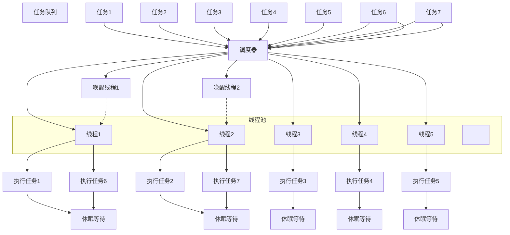

# 线程池

## 前言

我相信，已经阅读到这里的各位，不会对“*线程池*”这个词感到陌生。大部分开发者早就自己使用、学习，乃至实现过线程池。那不如我们先来进行一下基础的名词解释。

- ***什么叫线程池？***

“**线程**”没什么好说的，是 CPU 调度的最小单位，也是操作系统的一种抽象资源。

“**池**”？水池装着水，线程池则是装着线程，是一种抽象的指代。

抽象的来说，可以当做是一个池子中存放了一堆线程，**故称作线程池**。简而言之，线程池是指代一组**预先创建的**、**可以复用的线程集合**。这些线程由线程池管理，用于执行多个任务而**无需频繁地创建和销毁**线程。



> 这是一个典型的线程池结构。线程池包含一个**任务队列**，当有新任务加入时，调度器会将任务分配给线程池中的空闲线程进行执行。线程在执行完任务后会进入**休眠状态**，等待**调度器**的下一次**唤醒**。当有新的任务加入队列，并且有线程处于休眠状态时，调度器会唤醒休眠的线程，并分配新的任务给它们执行。线程执行完新任务后，会再次进入休眠状态，直到有新的任务到来，调度器**才可能**会再次唤醒它们。
>
> 图中线程1 就是被调度器分配了任务1，执行完毕后休眠，然而新任务的到来让调度器再次将它唤醒，去执行任务6，执行完毕后继续休眠。

使用线程池的益处我们已经加粗了，然而这其实并不是“*线程池*”独有的，任何创建和销毁存在较大开销的设施，都可以进行所谓的“***池化***”。

常见的还有：**套接字连接池**、**数据库连接池**、**内存池**、**对象池**。

---

了解以上这些基础概念是第一步也是最后一步，随着水平的提升，对这些概念的理解也会逐渐提升。

## 市面上常见的线程池

在了解了线程池的基本概念与运行逻辑后，我们不用着急就尝试实现。我们可以先来聊一聊，使用一下市面上常见的那些 C++ 线程池设施，了解它们提供的功能，接口设计的方式。

### `boost::asio::thread_pool`

[`boost::asio::thread_pool`](https://think-async.com/Asio/asio-1.11.0/doc/asio/reference/thread_pool.html) 是 [`Boost.Asio`](https://www.boost.org/doc/libs/1_85_0/doc/html/boost_asio.html) 库提供的一种线程池实现。

> Asio 是一个跨平台的 C++ 库，用于**网络**和低级 I/O 编程，使用 **现代C++** 方法为开发人员提供一致的异步模型。

使用方法：

1. 创建线程池对象，指定或让 Asio 自动决定线程数量。

2. 提交任务：通过 [`boost::asio::post`](https://beta.boost.org/doc/libs/1_82_0/doc/html/boost_asio/reference/post.html) 函数模板提交任务到线程池中。

3. 阻塞，直到池中的线程完成任务。

```cpp
#include <boost/asio.hpp>
#include <iostream>

std::mutex m;

void print_task(int n) {
    std::lock_guard<std::mutex> lc{ m };
    std::cout << "Task " << n << " is running on thr: " <<
        std::this_thread::get_id() << '\n';
}

int main() {
    boost::asio::thread_pool pool{ 4 }; // 创建一个包含 4 个线程的线程池

    for (int i = 0; i < 10; ++i) {
        boost::asio::post(pool, [i] { print_task(i); });
    }

    pool.join(); // 等待所有任务执行完成
}
```

> [运行](https://godbolt.org/z/41445Kab5)测试。

- 创建线程池时，指定线程数量，线程池会创建对应数量的线程。

- 使用 `boost::asio::post` 提交任务，任务会被添加到任务队列中。

- 线程池中的线程会从任务队列中取出任务并执行，任务执行完毕后，线程继续取下一个任务或者休眠。

- 调用 join 方法等待所有任务执行完毕并关闭线程池。

如果我们不自己指明线程池的线程数量，那么 Asio 会根据函数 [`default_thread_pool_size`](https://github.com/boostorg/asio/blob/44238d033e1503c694782925d647811380a067c2/include/boost/asio/impl/thread_pool.ipp#L53-L58) 计算并返回一个**线程池的默认线程数量**。它根据系统的硬件并发能力来决定使用的线程数，通常是硬件并发能力的两倍。

```cpp
inline long default_thread_pool_size()
{
  std::size_t num_threads = thread::hardware_concurrency() * 2;
  num_threads = num_threads == 0 ? 2 : num_threads;
  return static_cast<long>(num_threads);
}

thread_pool::thread_pool()
  : scheduler_(add_scheduler(new detail::scheduler(*this, 0, false))),
    num_threads_(detail::default_thread_pool_size())
```

代码很简单，就是 `thread::hardware_concurrency() * 2` 而已，至于下面的判断是因为  `std::thread::hardware_concurrency()` 在某些特殊情况下可能返回 `0`（例如硬件并发能力无法被检测时），那那将 `num_threads` 设置为 2，确保线程池至少有 2 个线程。

---

Boost.Asio 的线程池对象在[析构](https://github.com/boostorg/asio/blob/44238d033e1503c694782925d647811380a067c2/include/boost/asio/impl/thread_pool.ipp#L98-L103)时会自动调用相关的清理方法，但你也可以手动进行控制。

```cpp
thread_pool::~thread_pool()
{
  stop();     // 停止接收新任务
  join();     // 等待所有线程完成
  shutdown(); // 最终清理，释放资源
}
```

- `stop` ：修改内部的标志位存在使得线程池能够识别何时需要停止接收新的任务，以及关闭还没开始执行的任务，然后唤醒所有线程。
- `join()` ：等待所有线程完成它们的工作，确保所有线程都已终止。
- `shutdown()` ：进行最终的清理，释放资源，确保线程池的完全清理和资源的正确释放

> 此处可阅读部分源码，帮助理解与记忆

析构函数先调用了 `stop()` ，然后再进行 `join()` 。那如果我们没有提前显式调用 `join()` 成员函数，**可能导致一些任务没有执行，析构函数并不会等待所有任务执行完毕**：

```cpp
boost::asio::thread_pool pool{ 4 }; 

for (int i = 0; i < 10; ++i) {
    boost::asio::post(pool, [i] { print_task(i); });
}
```

> [运行](https://godbolt.org/z/MPoxrY9Yo)测试。

因为析构函数并不是阻塞直到执行完所有任务，而是先**停止**，再 `join()` 以及 `shutdown()`。

`Boost.Asio` 提供的线程池使用十分简单，接口高度封装，几乎无需关心底层具体实现，易于使用。

我们的操作几乎只需创建线程池对象、将任务加入线程池、在需要时调用 `join()`。

```cpp
boost::asio::thread_pool pool{4};  // 创建线程池
boost::asio::post(pool, task);     // 将任务加入线程池
pool.join();                       // 等待任务完成 （或者析构自动调用）
```

### `QThreadPool`

[`QThreadPool`](https://doc.qt.io/qt-6/qthreadpool.html) 是 Qt 提供的线程池实现，它是用来管理自家的 `QThreads` 的集合。

```cpp
#include <QCoreApplication>
#include <QThreadPool>
#include <QRunnable>
#include <QDebug>

struct MyTask : public QRunnable{
    void run() override {
        qDebug() << "🐢🐢🐢🐢🐢";
    }
};

int main(int argc, char *argv[]){
    QCoreApplication app(argc, argv);

    QThreadPool *threadPool = QThreadPool::globalInstance();

    // 线程池最大线程数
    qDebug()<< threadPool->maxThreadCount();

    for (int i = 0; i < 10; ++i) {
        MyTask *task = new MyTask{};
        threadPool->start(task);
    }
    // 当前活跃线程数 10
    qDebug()<<threadPool->activeThreadCount();

    app.exec();
}
```

与 `Asio.thread_pool` 不同，`QThreadPool` 采用单例模式，通过静态成员函数 `QThreadPool::globalInstance()` 获取对象实例（不过也可以自己创建）。默认情况下，`QThreadPool` 线程池的最大线程数为当前硬件支持的并发线程数，例如在我的硬件上为 `20`，这点也和 `Asio.thread_pool` 不同。

`QThreadPool` 依赖于 Qt 的事件循环，因此我们使用了 `QCoreApplication`。

而将任务添加到线程池中的做法非常古老原始，我们需要**自定义一个类型继承并重写虚函数 `run`**，创建任务对象，然后将任务对象传递给线程池的 `start` 方法。

> 这种方法过于原始，如果读者学过 `java` 相信也不会陌生。我们实现的线程池不会是如此。

在 Qt6，引入了一个 [`start`](https://doc.qt.io/qt-6/qthreadpool.html#start-1) 的重载版本：

```cpp
template <typename Callable, QRunnable::if_callable<Callable>>
void QThreadPool::start(Callable &&functionToRun, int priority)
{
    start(QRunnable::create(std::forward<Callable>(functionToRun)), priority);
}
```

它相当于是对[`start` 原始版本](https://doc.qt.io/qt-5/qthreadpool.html#start)的：

```cpp
void start(QRunnable *runnable, int priority = 0);
```

> [源码](https://codebrowser.dev/qt6/qtbase/src/corelib/thread/qthreadpool.cpp.html#_ZN11QThreadPool5startEP9QRunnablei)。

进行的一个**包装**，以支持任何的[*可调用(*Callable*)*](https://zh.cppreference.com/w/cpp/named_req/Callable)类型，而无需再繁琐的继承重写 `run` 函数。

```cpp
threadPool->start([=]{
    qDebug()<<QString("thread id %1").arg(i);
});
```

---

`QThradPool` 还支持手动控制[**任务优先级**](https://doc.qt.io/qt-6/qthread.html#Priority-enum)。通过调用 `start` 成员函数，将任务传递给线程池后可以再指明执行策略。

 [`enum QThread::Priority`](https://codebrowser.dev/qt6/qtbase/src/corelib/thread/qthread.h.html#QThread::Priority) 枚举类型表示操作系统**应如何调度新创建的线程**。

| 常量                            |  值  | 描述                                       |
| :------------------------------ | :--: | -----------------------------------------|
| `QThread::IdlePriority`         |  0   | 仅在没有其他线程运行时调度。                  |
| `QThread::LowestPriority`       |  1   | 调度频率低于 LowPriority。                  |
| `QThread::LowPriority`          |  2   | 调度频率低于 NormalPriority。               |
| `QThread::NormalPriority`       |  3   | 操作系统的默认优先级。                       |
| `QThread::HighPriority`         |  4   | 调度频率高于 NormalPriority。               |
| `QThread::HighestPriority`      |  5   | 调度频率高于 HighPriority。                 |
| `QThread::TimeCriticalPriority` |  6   | 尽可能频繁地调度。                           |
| `QThread::InheritPriority`      |  7   | 使用与创建线程相同的优先级。 这是默认值。        |

到此也就足够了，虽然还有不少接口没有介绍，不过也都没什么特别的了。

## 实现线程池

实现一个普通的能够满足日常开发需求的线程池实际上非常简单，只需要不到一百行代码。

> - “*普通的能够满足日常开发需*求的”
>
>   其实绝大部分开发者使用线程池，只是为了不重复多次创建线程罢了。所以只需要一个提供一个外部接口，可以传入任务到任务队列，然后安排线程去执行。无非是使用条件变量、互斥量、原子标志位，这些东西，就足够编写一个满足绝大部分业务需求的线程池。

我们先编写一个**最基础的**线程池，首先确定它的数据成员：

```cpp
class ThreadPool {
    std::mutex                mutex_;
    std::condition_variable   cv_;
    std::atomic<bool>         stop_;
    std::atomic<std::size_t>  num_threads_;
    std::queue<Task>          tasks_;
    std::vector<std::thread>  pool_;
};
```

1. **`std::mutex mutex_`**
   - 用于保护共享资源（如任务队列）在多线程环境中的访问，避免数据竞争。

2. **`std::condition_variable cv_`**
   - 用于线程间的同步，允许线程等待特定条件（如新任务加入队列）并在条件满足时唤醒线程。

3. **`std::atomic<bool> stop_`**
   - 指示线程池是否停止。

4. **`std::atomic<std::size_t> num_threads_`**
   - 表示线程池中的线程数量。

5. **`std::queue<Task> tasks_`**
   - 任务队列，存储等待执行的任务，任务按提交顺序执行。

6. **`std::vector<std::thread> pool_`**

   - 线程容器，存储管理线程对象，每个线程从任务队列中获取任务并执行。

**标头依赖**：

```cpp
#include <iostream>
#include <thread>
#include <mutex>
#include <condition_variable>
#include <future>
#include <atomic>
#include <queue>
#include <vector>
#include <syncstream>
#include <functional>
```

提供构造析构函数，以及一些外部接口：`submit()`、`start()`、`stop()`、`join()`，也就完成了：

```cpp
inline std::size_t default_thread_pool_size()noexcept {
    std::size_t num_threads = std::thread::hardware_concurrency() * 2;
    num_threads = num_threads == 0 ? 2 : num_threads;
    return num_threads;
}

class ThreadPool {
public:
    using Task = std::packaged_task<void()>;

    ThreadPool(const ThreadPool&) = delete;
    ThreadPool& operator=(const ThreadPool&) = delete;

    ThreadPool(std::size_t num_thread = default_thread_pool_size())
        : stop_{ false }, num_threads_{ num_thread } {
        start();
    }

    ~ThreadPool() {
        stop();
    }

    void stop() {
        stop_.store(true);
        cv_.notify_all();
        for (auto& thread : pool_) {
            if (thread.joinable()) {
                thread.join();
            }
        }
        pool_.clear();
    }

    template<typename F, typename... Args>
    std::future<std::invoke_result_t<std::decay_t<F>, std::decay_t<Args>...>> submit(F&& f, Args&&...args) {
        using RetType = std::invoke_result_t<std::decay_t<F>, std::decay_t<Args>...>;
        if (stop_.load()) {
            throw std::runtime_error("ThreadPool is stopped");
        }

        auto task = std::make_shared<std::packaged_task<RetType()>>(
            std::bind(std::forward<F>(f), std::forward<Args>(args)...));
        std::future<RetType> ret = task->get_future();

        {
            std::lock_guard<std::mutex> lc{ mutex_ };
            tasks_.emplace([task] {(*task)(); });
        }
        cv_.notify_one();
        return ret;
    }

    void start() {
        for (std::size_t i = 0; i < num_threads_; ++i) {
            pool_.emplace_back([this] {
                while (!stop_) {
                    Task task;
                    {
                        std::unique_lock<std::mutex> lc{ mutex_ };
                        cv_.wait(lc, [this] {return stop_ || !tasks_.empty(); });
                        if (tasks_.empty())
                            return;
                        task = std::move(tasks_.front());
                        tasks_.pop();
                    }
                    task();
                }
            });
        }
    }

private:
    std::mutex                mutex_;
    std::condition_variable   cv_;
    std::atomic<bool>         stop_;
    std::atomic<std::size_t>  num_threads_;
    std::queue<Task>          tasks_;
    std::vector<std::thread>  pool_;
};
```

**测试 demo**：

```cpp
int main() {
    ThreadPool pool{ 4 }; // 创建一个有 4 个线程的线程池
    std::vector<std::future<int>> futures; // future 集合，获取返回值

    for (int i = 0; i < 10; ++i) {
        futures.emplace_back(pool.submit(print_task, i));
    }

    for (int i = 0; i < 10; ++i) {
        futures.emplace_back(pool.submit(print_task2, i));
    }

    int sum = 0;
    for (auto& future : futures) {
        sum += future.get(); // get() 成员函数 阻塞到任务执行完毕，获取返回值
    }
    std::cout << "sum: " << sum << '\n';
} // 析构自动 stop() 
```

**可能的[运行结果](https://godbolt.org/z/n7Tana59x)**：

```shell
Task 0 is running on thr: 6900
Task 1 is running on thr: 36304
Task 5 is running on thr: 36304
Task 3 is running on thr: 6900
Task 7 is running on thr: 6900
Task 2 is running on thr: 29376
Task 6 is running on thr: 36304
Task 4 is running on thr: 31416
🐢🐢🐢 1 🐉🐉🐉
Task 9 is running on thr: 29376
🐢🐢🐢 0 🐉🐉🐉
Task 8 is running on thr: 6900
🐢🐢🐢 2 🐉🐉🐉
🐢🐢🐢 6 🐉🐉🐉
🐢🐢🐢 4 🐉🐉🐉
🐢🐢🐢 5 🐉🐉🐉
🐢🐢🐢 3 🐉🐉🐉
🐢🐢🐢 7 🐉🐉🐉
🐢🐢🐢 8 🐉🐉🐉
🐢🐢🐢 9 🐉🐉🐉
sum: 90
```

> 如果等待线程池对象调用析构函数，那么效果如同 `asio::thread_pool`，会先进行 `stop`，这可能导致一些任务无法执行。不过我们在最后**循环遍历了 `futures`**，调用 `get()` 成员函数，不存在这个问题。

它支持**任意可调用类型**，当然也包括非静态成员函数。我们使用了 [`std::decay_t`](https://zh.cppreference.com/w/cpp/types/decay)，所以参数的传递其实是**按值复制**，而不是引用传递，这一点和大部分库的设计一致。示例如下：

```cpp
struct X {
    void f(const int& n) const {
        std::osyncstream{ std::cout } << &n << '\n';
    }
};

int main() {
    ThreadPool pool{ 4 }; // 创建一个有 4 个线程的线程池

    X x;
    int n = 6;
    std::cout << &n << '\n';
    auto t = pool.submit(&X::f, &x, n); // 默认复制，地址不同
    auto t2 = pool.submit(&X::f, &x, std::ref(n));
    t.wait();
    t2.wait();
} // 析构自动 stop()
```

> [运行](https://godbolt.org/z/vY458T44e)测试。

我们的线程池的 `submit` 成员函数在传递参数的行为上，与先前介绍的 `std::thread` 和 `std::async` 等设施基本一致。

我们稍微介绍线程池的接口：

 **构造函数和析构函数：**

- **构造函数**：初始化线程池并**启动线程**。

- **析构函数**：停止线程池并等待所有线程结束。

**外部接口：**

- **`stop()`**：停止线程池，通知所有线程退出（不会等待所有任务执行完毕）。
- **`submit()`**：将任务提交到任务队列，并返回一个`std::future`对象用于获取任务结果以及确保任务执行完毕。
- **`start()`**：启动线程池，创建并启动指定数量的线程。

我们并没有提供一个功能强大的所谓的“***调度器***”，我们只是利用条件变量和互斥量，让操作系统自行调度而已，它并不具备设置任务优先级之类的调度功能。

当然，你可能还希望我们的线程池具备更多功能或改进，比如控制任务优先级、设置最大线程数量、返回当前活跃线程数等。此外，异常处理也是一个值得考虑的方面。

有些功能实现起来非常简单，而有些则需要更多的思考和设计。不过，这些功能超出了本次讲解的范围。如果有兴趣，可以尝试自行优化我们提供的线程池实现，添加更多的功能。我们给出的线程池实现简单完善且直观，用来学习再好不过。

## 总结

在本章中我们详细的介绍了：

- 线程池的基本概念。

- 市面上常见的线程池的设计与使用， `boost::asio::thread_pool`、`QThreadPool`。
- 实现一个简易的线程池。

总体而言，内容并不构成太大的难度。

**课后作业**：自己实现一个线程池，可以参考我们给出的线程池实现增加功能，提交到 `homework` 文件夹中。
